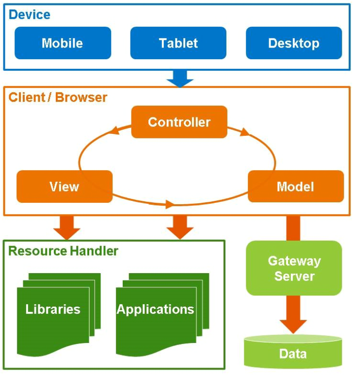

# SAP OpenUI5 <!-- omit in toc -->

 <!-- .element: style="width:50%;" -->

--
**C. "Elliot" Heeren**  
  <!-- .element: style="width:50%;" -->  
Matr. : *1291292*

Note: Image size too large

--
### Content
- [Fiori](#fiori)
- [SAP UI5](#sap-ui5)
  - [Architecture](#architecture)
- [UI5 vs. *Open*UI5](#ui5-vs-openui5)
- [Usage](#usage)
  - [Initialization](#initialization)
  - [XML Views](#xml-views)
  - [Controller](#controller)
  - [Model (e.g. JSON / XML / *OData*)](#model-eg-json--xml--odata)
- [Case Study](#case-study)
- [Assessment](#assessment)

==
## Fiori
<!--  -->
UI Design-Concept von SAP:
+ Standardized:
  + across all SAP products
  + across all devices
+ Open Standard

[Fiori Design Guidelines](https://experience.sap.com/fiori-design/) <!--.element target="_blank"--> <br>
[Button Design](https://experience.sap.com/fiori-design-web/button/) <!--.element target="_blank"--> 

--
## SAP UI5
(SAP UI Development Toolkit for HTML5)
<div style="display:flex"> <!-- .element class="fragment fade-up"  -->
<div>

+ JS-library for Fiori-compliant web-apps
+ Focus on: 
  + Displaying and modifying data
  + Business applications
+ Localization support

</div>

</div>

==
### Architecture
 <!--.element: style="height:50vh" -->

--
## UI5 vs. *Open*UI5

<div style="display:flex">
<div> <!-- .element class="fragment fade-up"  -->

SAP UI5
+ All features:
    + Core runtime libraries
    + All Control
+ (In-House) Support
+ Faster Patches
+ Only for SAP

</div>
<div> <!-- .element class="fragment fade-up"  -->

Open UI5
+ Not all features:
  + Core runtime libraries
  + only some additional libraries
+ Open Source <br> (Apache License 2.0): <br> [GitHub.com](https://github.com/SAP/openui5)
</div>
</div>

==<!--.element: data-auto-animate -->
## Usage

### Initialization

```html [6,8,15-16|19,20|9-13|14]
  <!DOCTYPE html>
  <html>
    <head>
      <meta charset="utf-8">
      <title>SAPUI5 Walkthrough</title>
      <script
        id="sap-ui-bootstrap"
        src="https://sdk.openui5.org/resources/sap-ui-core.js"
        data-sap-ui-theme="sap_fiori_3_dark"
        data-sap-ui-async="true"
        data-sap-ui-resourceroots='{
          "sap.ui.demo.walkthrough": "./"
        }'
        data-sap-ui-onInit="module:sap/ui/demo/walkthrough/index"
      >
      </script>
    </head>
  
    <body class="sapUiBody" id="content">
    </body>

  </html>
```

--
<!--.element: data-auto-animate -->
### Initialization <!-- omit in toc -->
/index.js
```javascript [|1-3|6-10|7]
  sap.ui.define([
    "sap/ui/core/mvc/XMLView"
  ], function (XMLView) {
    "use strict";
  
    XMLView.create({
      viewName: "sap.ui.demo.walkthrough.view.App"
    }).then(function (oView) {
      oView.placeAt("content");
    });
  
  });
```

--
<!--.element: data-auto-animate -->
### XML Views
```javascript
  viewName: "sap.ui.demo.walkthrough.view.App"
```
```javascript
  data-sap-ui-resourceroots='{
          "sap.ui.demo.walkthrough": "./"
        }'
```

<div>

  /view/App.view.xml
  ```xml [|1-3,5|4]
  <mvc:View
      xmlns="sap.m">
  
      <Text text="Hello World"/>
  </mvc:View>
  ```
</div>
<!-- .element class="fragment fade-up"  -->

--
<!-- .element data-background-iframe="/content/ui5_examples/view/webapp" -->
--
<!--.element: data-auto-animate -->

### Controller

<div>

  ```xml [1-2,15|5-13|3]
  <mvc:View
    xmlns="sap.m"
    controllerName="hello_world.controller.say">
  
      <Button icon="sap-icon://geographic-bubble-chart"
              type="Accept"
              press="onHello"
              text="Say Hello"></Button>
  
      <Input placeholder="Name"
             width="20vw"
             id="name"
             submit="onHello"></Input>
  
  </mvc:View>
  ```
</div><!-- .element class="fragment fade-up"  -->

--
<!--.element: data-auto-animate -->
### Controller <!-- omit in toc -->

```xml
<mvc:View controllerName="hello_world.controller.say">
```
```javascript
  data-sap-ui-resourceroots='{
          "hello_world": "./"
        }'
```

<div>

  /controller/say.controller.js
  ```javascript [1-3, 13|6-12]
    sap.ui.define(['sap/m/MessageToast',
                   'sap/ui/core/mvc/Controller'],
      function(MessageToast, Controller) {
      "use strict";

      var PageController = 
              Controller.extend("hello_world.controller.say", {

          // custom event handlers here
      });

      return PageController;
    });
  ```
</div>
<!-- .element class="fragment fade-up" -->

--
<!--.element: data-auto-animate -->
### Controller <!-- omit in toc -->

/controller/say.controller.js
```javascript [9-19]
  sap.ui.define(['sap/m/MessageToast',
                 'sap/ui/core/mvc/Controller'],
    function(MessageToast, Controller) {
    "use strict";

    var PageController = 
            Controller.extend("hello_world.controller.say", {

      onHello: function (evt) {
        let name = this.getView().byId("name").getValue();

        let message = ""
        if (name === "")
          message = "Hello World!"
        else
          message = "Hello " + name + "!"

        MessageToast.show(message);
      }
    });

    return PageController;
  });
```
--
<!-- .element data-background-iframe="/content/ui5_examples/controller/webapp" -->
--
<!--.element: data-auto-animate -->
### Model (e.g. JSON / XML / *<u>OData</u>*)
/model/cities.json

```json [2-14|16-24]
{
  "cities": [
    {
      "country": "AD",
      "name": "Sant Julià de Lòria",
      "lat": "42.46372",
      "lng": "1.49129"
    },
    {
      "country": "AD",
      "name": "Pas de la Casa",
      "lat": "42.54277",
      "lng": "1.73361"
    }, ...],

  "countries": [
    {
      "name": "Afghanistan",
      "code": "AF"
    },
    {
      "name": "land Islands",
      "code": "AX"
    }, ...]
}
```
--
<!--.element: data-auto-animate -->

### Model (e.g. JSON / XML / *<u>OData</u>*) <!-- omit in toc -->
**Loading:**

```javascript [2,3|9-13,20-21|15-18]
sap.ui.define(['sap/ui/core/mvc/Controller',
               'sap/ui/model/json/JSONModel'],
  function(Controller, JSONModel) {
  "use strict";

  var PageController = 
        Controller.extend("cities.controller.app", {

    onInit: function() {
      let oModel = new JSONModel();
      // loading can be sync or async
      oModel.loadData('./model/cities.json', null, false);
      let data = oModel.getData();

      data.cities.forEach(city => {
        city.description = 
          "latitude: " + city.lat + " | longitude: " + city.lng;
      });

      this.getView().setModel(oModel);
    }

  });
  return PageController;
});

```

--
<!--.element: data-auto-animate -->
### Model (e.g. JSON / XML / *<u>OData</u>*) <!-- omit in toc -->
**Using in view:**

```xml [6-14|7,12-14]
<mvc:View
  xmlns="sap.m"
  xmlns:mvc="sap.ui.core.mvc"
  controllerName="cities.controller.app">
	
  <List headerText="Cities of The World"
        items="{/cities}"
        growing="true"
        growingThreshold="20"
        growingScrollToLoad="true">
      <StandardListItem 
          title="{name}"
          info="{country}"
          description="{description}"/>
  </List>

</mvc:View>
```

--
<!-- .element data-background-iframe="/content/ui5_examples/model/webapp" -->

==

## Case Study

==

## Assessment
**Why should one use SAP OpenUI5?**
<div style="display:flex">
<div> <!-- .element class="fragment fade-up"  -->

Advantages:
+ Fiori-Design Compliant:
  + Unified standardized design
  + Accessible Webapps
  + Skip UI-design phase mostly
+ SAP-standard
+ Exceptional docs

</div>
<div> <!-- .element class="fragment fade-up" style="max-width:50%"  -->

Disadvantages:
+ Lots of boilerplate code
+ Separation of technology and concerns  
  -> complicated structure
+ Terrible loading times  
  (client side rendering)
</div>
</div>

<!-- --

## MIP <!-- omit in toc -->
**(Most important points)** -->

==

# Q & A <!-- omit in toc -->

--

## Sources <!-- omit in toc -->

<div style="text-align:left">

- [ui5.sap.com](https://ui5.sap.com/ )</div>